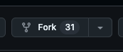
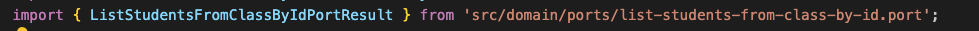
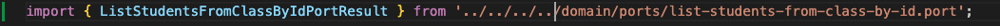

# professor-backend

- Realize um Fork da aplicação.

   

# Executar aplicação localmente
- Abra o terminal e garanta que você está dentro do repositório.
- $ npm i
- $ docker build -t professor-backend:fargate . (execute a cada alteração que realizar no código)
- $ docker-compose up --build (execute a cada alteração que realizar no código)

# Acesso
- A aplicação ficará disponível na porta 8080
- http://localhost:8080

# Dica

- Caso o seu auto import, traga o caminho do arquivo iniciando em 'src/' vc terá problemas para subir a aplicação. Garanta que vc está importando com o caminho relativo:

